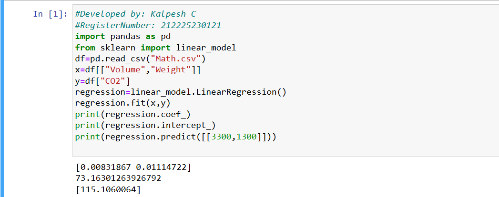

# Implementation of Multivariate Linear Regression
## Aim
To write a python program to implement multivariate linear regression and predict the output.
## Equipment’s required:
1.	Hardware – PCs
2.	Anaconda – Python 3.7 Installation / Moodle-Code Runner
## Algorithm:

### Step1
Import pandas and linear_model from sklearn, then load the CSV file using pd.read_csv().

### Step2
Store Volume and Weight as independent variables (x) and CO2 as the dependent variable (y).

### Step3
Create a LinearRegression() object and train it using fit(x, y).

### Step4
Print the regression coefficients, intercept, and predict the CO2 emission for the values [3300,1300] using predict().

## Program:
```
#Developed by: Kalpesh C
#RegisterNumber: 212225230121

import pandas as pd
from sklearn import linear_model
df=pd.read_csv("car (1).csv")
x=df[["Volume","Weight"]]
y=df["CO2"]
regression=linear_model.LinearRegression()
regression.fit(x,y)
print(regression.coef_)
print(regression.intercept_)
print(regression.predict([[3300,1300]]))
```
## Output:



## Result
Thus the multivariate linear regression is implemented and predicted the output using python program.